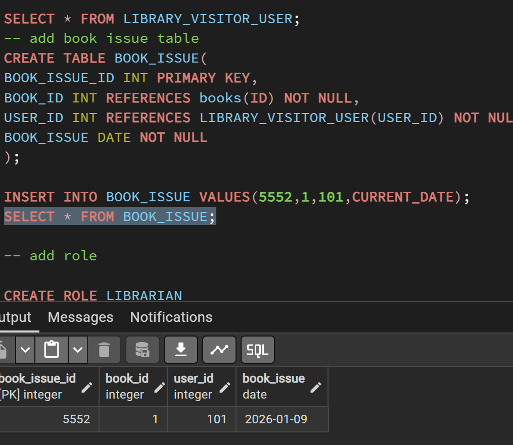
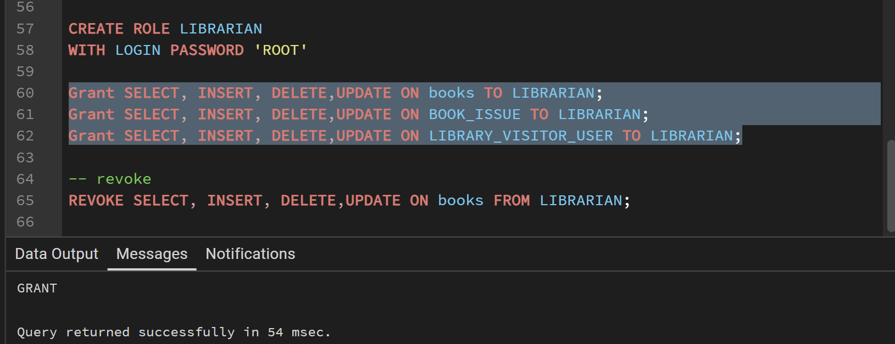
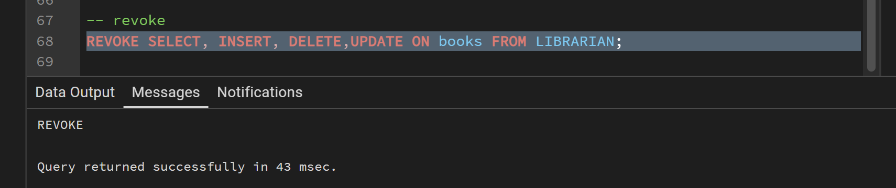
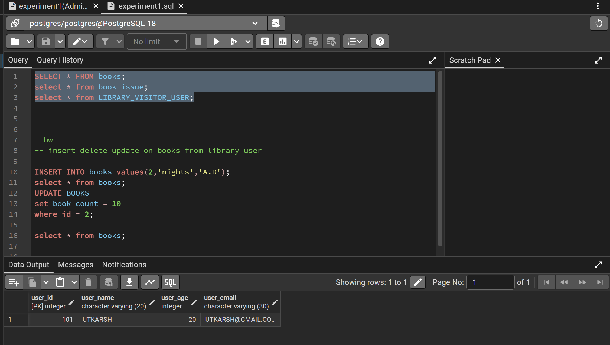
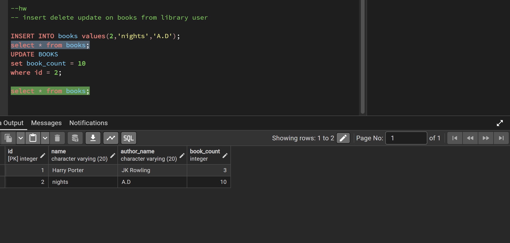

# Experiment 1 – Library Management System Database

## Experiment
**Experiment 1:** Design and implementation of a Library Management System using PostgreSQL with DDL, DML and DCL commands.

## Aim
The aim of this experiment is to design and implement a Library Management System database using PostgreSQL. The database is created using proper tables, primary keys, foreign keys and constraints. DML operations are performed and database security is implemented using roles and privileges.

## Objective
The objective of this experiment is to gain practical knowledge of DDL, DML and DCL commands in PostgreSQL. It also helps in understanding how to create roles, grant permissions and revoke permissions to secure the database using role based access control.

## Practical / Experiment Steps
1. Design the database structure for the Library Management System.
2. Create tables for books, members and issue records using DDL commands.
3. Apply primary keys, foreign keys and constraints to maintain data integrity.
4. Insert sample records into the tables using DML commands.
5. Update and delete records as required.
6. Create a database role named Librarian.
7. Grant required permissions like SELECT, INSERT and DELETE to the Librarian role.
8. Revoke permissions when needed to ensure database security.

## Procedure of the Experiment
1. Start the system and log in to the computer.
2. Open pgAdmin and connect to PostgreSQL server.
3. Create a new database for the Library Management System.
4. Create tables such as Books, Members and Issue_Records using CREATE TABLE command.
5. Define primary keys and foreign keys while creating the tables.
6. Insert records into tables using INSERT command.
7. Update existing data using UPDATE command.
8. Delete unwanted records using DELETE command.
9. Create a role named Librarian with password using CREATE ROLE command.
10. Grant SELECT, INSERT and DELETE permissions to the Librarian role.
11. Revoke permissions using REVOKE command when required.
12. Execute all queries and verify the output.
13. Save the work and take screenshots of execution and results.

## Input / Output Details

### Input
SQL commands for creating database, tables, inserting records, updating data, deleting records, creating roles and granting or revoking permissions.

### Output
Successful creation of tables, insertion of records, updated and deleted data, role creation and permission control.  
## Screenshots

### Table Creation

### DML Operations

### SELECT Output

### Role Creation and revoke
#### Grant

#### Revoke

### Running query in user server

### Modifying data in user server

## Learning Outcome
After completing this experiment, the student understood how to design a database using tables and constraints. The student learned how to use DDL, DML and DCL commands in PostgreSQL. This experiment also provided practical exposure to role based access control and database security.
