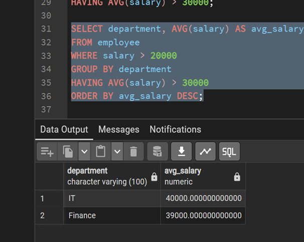
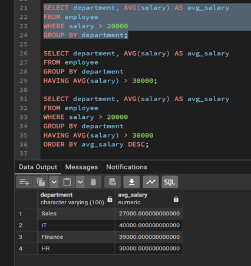
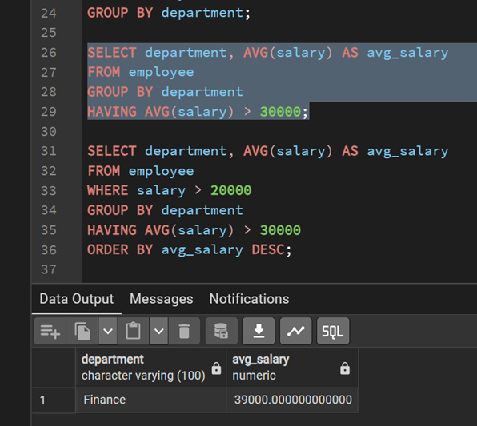

# Experiment 1.2 – SQL SELECT Queries with WHERE, GROUP BY, HAVING, ORDER BY

## Experiment
Experiment 1.2: Understanding and implementing SQL SELECT queries using WHERE, GROUP BY, HAVING, and ORDER BY clauses to retrieve and analyze data from relational database tables.

## Aim
The aim of this experiment is to practice writing SQL SELECT statements to filter, group, sort, and calculate aggregate values for meaningful analysis of employee data.

## Objective
- To practice writing SQL SELECT statements.  
- To filter records using the WHERE clause.  
- To group records using the GROUP BY clause.  
- To filter grouped data using the HAVING clause.  
- To sort query results using ORDER BY.  
- To calculate average salary using the AVG() aggregate function.

## Software Requirements
- Database: Oracle XE or PostgreSQL (PgAdmin)

## Practical / Experiment Steps
1. Display the department name and the average salary of employees for each department.  
2. Consider only those employees whose salary is greater than 20,000.  
3. Display only those departments where the average salary is greater than 30,000.  
4. Arrange the final output in descending order of average salary.

## Procedure of the Experiment
1. Start the system and log in to the computer.  
2. Open the required database tool (Oracle XE or PgAdmin).  
3. Connect to the database containing the EMPLOYEE table.  
4. Examine the EMPLOYEE table structure and data.  
5. Write the SQL SELECT queries according to the practical steps.  
6. Execute each query and verify the output.  
7. Take screenshots of all four query results in order and save them.  

## Input / Output Details

### Input
- EMPLOYEE table with columns: emp_id, emp_name, department, salary, joining_date.  
- SQL SELECT queries using WHERE, GROUP BY, HAVING, ORDER BY, and AVG().

### Output
- Step 1: Average salary of employees by department.  
- Step 2: Average salary by department for employees with salary > 20,000.  
- Step 3: Departments where average salary > 30,000.  
- Step 4: Departments with average salary > 30,000 for salary > 20,000, sorted in descending order.  
- Screenshots of query execution (s1 to s4) are attached in order.

### Step 1 Output

### Step 2 Output

### Step 3 Output

### Step 4 Output

## Learning Outcome
After completing this experiment, the student will be able to:  
- Filter records using the WHERE clause.  
- Group records using the GROUP BY clause.  
- Apply conditions on grouped data using the HAVING clause.  
- Sort query results using ORDER BY.  
- Analyze data using aggregate functions like AVG() for meaningful insights.